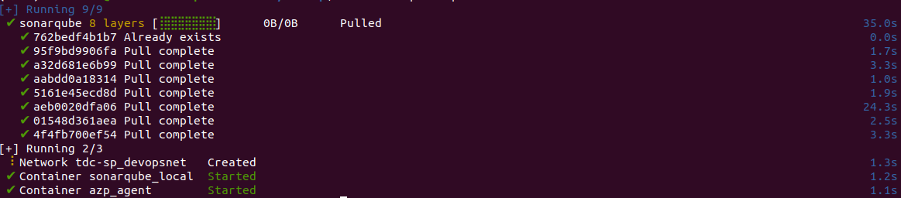

# Introdução

Este repositório contém o exemplo utilizado na apresentação "Externalizando as políticas de qualidade do código com Open Policy Agent" realizada no TDC Sao Paulo 2024.

O exemplo consiste de um pipeline do Azure DevOps que faz o build & test da aplicação [Spring PetClinic](https://github.com/spring-projects/spring-petclinic), executa o análise estática do código com o [SonarQube](https://www.sonarsource.com/products/sonarqube/) e, se o código analisado falhar em atingir os quality gates definidos, o Open Policy Agent (OPA) é utiizado pelo pipeine para decidir se o projeto pode ou não continuar pelo pipeline mesmo sem ter atingido os quality gates.

Denominamos o processo de passar pelo pipeline sem atingir os quality gates de ["Waiver"](https://en.wikipedia.org/wiki/Waiver) e ele é aplicado por uma política externa ao pipeline escrita com a linguagem REGO do OPA.

O Waiver é uma espécie de liminar temporária concedida aos projetos que não conseguem efetuar os ajuste para atingirem os quality gates em tempo hábil para atingir seus deadlines de entrega. Ele envolve um processo de negócio com aprovação dos responsáveis pelo projeto e com o compromisso de um roadmap para corrigir os problemas de qualidade do código da aplicação.

O OPA foi utilizado neste cenário porque ele permite separar a decisão de uma política da sua aplicação propriamente dita, isto é, o pipeline não precisa se preocupar com as regras desta política, precisando só da resposta "sim" ou "não" se o Waiver deve ser aplicado para o projeto em questão. A política, por sua vez, é elaborada e mantida por outra equipe que não a equipe responsável pelos pipelines da empresa.

Mais informações sobre o OPA: https://www.openpolicyagent.org/docs/latest/.

# Utilizando o exemplo

## Visão geral

A raiz deste repositório contém além dos componentes da aplicação SprintBoot PetClinic, os seguintes diretórios:

| Diretório    | Descrição    |
|--------------|--------------|
| .ambiente    | Arquivos utilizados para subir o ambiente para executar o pipeline no Azure DevOps (agente e SonarQube).
| .azuredevops | Definição do pipeline e arquivos da política de Waiver com OPA. |

**Atenção:** colocamos os arquivos de política dentro deste repositório por questões práticas, no entanto, o ideal é que estes arquivos fiquem num repositório ou local externo apartado do pipeline.

## Subindo o ambiente

Eis aqui o que você vai precisar para rodar este exemplo.

### Pre-requisitos

Máquina local:

- Conectividade com a Internet
- Docker
- Docker Compose

Azure DevOps:

1. Criar uma organização no Azure DevOps. [Mais info](https://learn.microsoft.com/en-us/azure/devops/organizations/accounts/create-organization.?view=azure-devops).
2. Instalar extensão SonarQube na organização do Azure DevOps, clicando no botão "Get it free" e seguindo as instruções. [Mais info](https://marketplace.visualstudio.com/items?itemName=SonarSource.sonarqube).
3. Criar um projeto na sua organização do Azure DevOps. [Mais info](https://learn.microsoft.com/en-us/azure/devops/organizations/projects/create-project?view=azure-devops&tabs=browser).
4. Solicitar paralelismo gratuito para sua organização do Azure DevOps, caso não tenha ainda. Este processo pode demorar de 2 a 3 dias úteis. [Formulário](https://forms.office.com/pages/responsepage.aspx?id=v4j5cvGGr0GRqy180BHbR5zsR558741CrNi6q8iTpANURUhKMVA3WE4wMFhHRExTVlpET1BEMlZSTCQlQCN0PWcu&route=shorturl).
5. Criar PAT (Personal Access Token) para configuração do agente self-hosted com escopo "Agent Pools (Read & Manage)". Anote o PAT, pois o utilizaremos mais adiante. [Mais info](https://learn.microsoft.com/en-us/azure/devops/pipelines/agents/personal-access-token-agent-registration?view=azure-devops).
6. Importe este repositório no seu projeto do Azure DevOps. [Mais info](https://learn.microsoft.com/en-us/azure/devops/repos/git/import-git-repository?view=azure-devops).


### Executar SonarQube e agente self-hosted do Azure DevOps

Aqui você vai subir via Docker na sua máquina uma instância local do SonarQube Community e um agente self-hosted do Azure DevOps para executar o pipeline que será criado.

Preencha os valores das variáveis no arquivo `.ambiente/docker-compose.yaml`:

```YAML
    environment:
      - AZP_URL=https://dev.azure.com/<SUA-ORGANIZACAO-AZDO>
      - AZP_TOKEN=<SEU-PAT-AZDO>
```

**Nota**: não commite as alterações feitas no arquivo docker-compose.yaml para não expor o seu PAT.

Salve o arquivo e execute o docker compose para subir os serviços:

```sh
docker compose up -d
```

Certifique-se de executar o comando acima dentro do diretório `.ambiente`.



Em poucos minutos o agente deve aparecer online no Azure DevOps (Project Settings | Agent pools | Default | aba Agents) e o SonarQube estará disponível.


#### Criar token no SonarQube

Abra o navegador e acesse o SonarQube em http://localhost:9000.

Faça o login com usuário/senha admin/admin e troque a senha deste usuário, conforme solicitado.

O token criado será utilizado para analisar os projetos através do pipeline do Azure DevOps.

- Clicar no avatar no canto superior direito da tela
- Clicar em "My Account"
- Abrir aba "Security"
- Em "Generate Tokens", informar um nome para o token ("az-pipelines"), tipo "Global Analysis Token" e clicar em "Generate"
- Guarde o token

#### Criar Service Connection no projeto do Azure DevOps

A Service Connection é utilizada pelo pipeline para se comunicar com a instância local do SonarQube que subimos no passo anterior.

- Na página do projeto, clique em Project Settings no canto inferior esquerdo da tela
- Clique em Service Connections
- Clique no botão "New serice connection" no canto superior direito.
- Selecione "SonarQube" e clique Next.
- Preencha os campos da seguinte forma:
    - Server url: http://sonarqube:9000
    - Token: <token-do-sonarqube-criado-anteriormente>
    - Service connectio name: Sonar
- Marque a opção "Grant access permission to all pipelines"


#### Criar um Variable Group no Azure DevOps

Iremos criar neste Variable Group uma variável para armazenar o token do SonarQube, pois o nosso pipeline contém um script que faz chamadas à API do SonarQube.

No seu projeto do Azure DevOps, clique no item "Library" da seção "Pipelines" do menu lateral.

- Clique no botão "+ Variable Group".
- Digite o nome para o Variable Group: exemplo-waiver.
- Na seção Variable, clique em "Add".
- Preencha o nome da variável: SONARQUBE_TOKEN.
- Cole o token do SonarQube no campo valor e clique no ícone do cadeado para proteger essa variável sensível.
- Clique no botão "Save" na barra de menus superior.


## Criando o pipeline

Agora que temos o ambiente configurado, vamos criar o pipeline e executá-lo.

No seu projeto do Azure DevOps, clique no item "Pipelines" do menu lateral.

- Clique no botão "New pipeline" no canto superior direito.
- Selecione a opção "Azure Repos Git".
- Selecione o repositório importado lá no início deste guia.
- Clique na opção "Existing Azure Pipeline YAML file".
- Escolha no campo "Path" o arquivo "/.azuredevops/azure-pipeline.yaml" e clique em Continue.
- Clique no botão "Run" para executar o pipeline.

A primeira execução bem sucecida do pipeline fará o scan do Sonarqube, criando o baseline de qualidade deste projeto.

O projeto passará com sucesso pelos quality gates, pois a aplicação Sprint PetClinic possui testes unitários e cobertura de código maior que 80%.


## Utilizando a política de Waiver

Agora que temos um baseline bem sucedido para este projeto no Sonarqube, podemos manipular o projeto para que ele itencionalmente não passe nos quality gates nas próximas execuções do pipeline.

Com isso podemos testar a política de Waiver.

### Diminuindo a cobertura de código do projeto

Para os passos abaixo, recomenda-se fazer um git clone do seu repositório no seu projeto no Azure DevOps. No entanto, você pode também fazê-lo diretamente no Azure Repos.

1. Entre no diretório `src/main/java/org/springframework/samples/petclinic/vet`
2. Renomeie o arquivo `Vet.java` para `Vet.java.original`.
3. Renomeie o arquivo `Vet.java.coverage_fail` para `Vet.java`.
4. (se alterando localmente) Faça Commit e Push das alterações.
5. Execute o pipeline.

O pipeline deve quebrar na avaliação dos quality gates, mais especificamente na métrica de cobertura de código.


### Ativando o Waiver para o projeto

Edite o arquivo `.azuredevops/opa/sonar-waiver-data.json`, substituindo o nome "tdc-sp-waiver-spring-petclinic" pelo nome do seu projeto + nome do seu repositório separados por um hífen.

Você pode ver o nome do projeto e o nome do repositório na tela do Azure DevOps, como demonstrado a seguir para o exemplo "tdc-sp-waiver-spring-petclinic", onde "tdc-sp-waiver" é o nome do projeto e "spring-petclinic" é o nome do repositório.


Em nosso cenário a política de Waiver é configurada para cada projeto + repositório. Ao fazer esse ajuste, a política de Waiver estará ativa para o nosso projeto, permitindo que o pipeline finalize sem quebrar por conta do não atingimento dos quality gates.

Certifique-se de que o campo "due-date" (data de vigência do Waiver) contenha uma data/hora maior que a data/hora atual. Caso contrário, a política de Waiver será encontrada, mas não será aplicada com sucesso, pois estará expirada.

```JSON
{
    "waiver_projects": {
        "<nome-seu-projeto>-<nome-seu-repositorio>": {
            "due_date": "2030-09-01T22:25:00Z",
            "order_number": "548574585"
        }
    }
}
```

O campo "order_number" é só um mecanismo para podermos rastrear qual pedido/ticket da ferramenta de ITSM da empresa está relacionado com este pedido de Waiver.

Execute o pipeline.

Agora ele deve avisar que os quality gates não foram atingidos, mas aplicará o Waiver e permitirá que o pipeline prossiga sem quebrar.


Caso o Waiver esteja expirado, o seguinte erro ocorrerá para informar que o Waiver não é válido:


Pronto! Todos os cenários do exemplo foram explorados!

# Aplicação da política de Waiver

A task "Quality Gate Evaluation" dentro do pipeline é reponsável por avaliar o status do scan de análise estática de código realizada pelo SonarQube e também pela aplicação da política de waiver, caso haja alguma configurada, em caso de falha no atingimento dos quality gates.

Neste exemplo isto é feito dentro de um script bash onde são utilizadas as APIs do SonarQube, além do binário do Open Policy Agent (opa), o qual está instalado no container Docker do agente do Azure DevOps (`.ambiente/azp-agent-in-docker/Dockerfile`).

Para avaliação da política de Waiver utilizamos o comando `opa eval`, passando como parâmetros o arquivo da política (Rego), o arquivo contendo as configurações de Waiver, os dados sobre o projeto corrente para o qual se deseja aplicar a política (`{"project": "<id-do-projeto-na-configuracao-do-waiver>"}`) e, por fim, a estrutura de dados da resposta no qual estamos interessados ("data.waiver").

Exemplo:

```sh
opa eval --data ".azuredevops/opa/sonar-waiver-policy.rego" --data ".azuredevops/opa/sonar-waiver-data.json" --input <(echo "{\"project\": \"<id-do-projeto-na-configuracao-do-waiver>\"}") "data.waiver"
```

Os parâmetros --data e --input recebem como entrada arquivos. Por este motivo utilizamos a substituição de processo para passar dinamicamente o JSON indicando o projeto corrento no parâmetro --input.

Já no parâmetro --data, que pode ser utilizado mútiplas vezes, passamos o arquivo de definção da política (REGO) e o arquivo contendo as configurações do Waiver para os projetos.

A política `sonar-waiver-policy.rego` avalia duas coisas:
- Se existe uma configuração de Waiver para o projeto corrente (*waiver_is_set*)
- Se a configuração de Waiver do projeto corrente está válida, isto é, não está expirada (*waiver_is_expired*).

O retorno da avaliação é por padrão uma estrutura JSON com o resultado dentro do elemento data.<package>, onde <package> neste caso chama-se "waiver".

O nome da regra criada no nosso arquivo de política é "allow", portanto o retorno da avaliação da política retornará "true" ou "false" no elemento "allow" dentro de data.waiver. É isso que determina para nós se a política foi aplicada.
